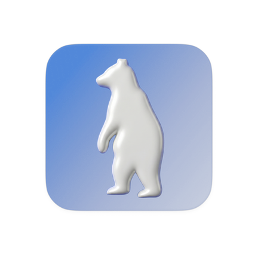

# Otso Mobile

<p align="center">
  
</p>

<p align="center">
  <strong>v2.0.0</strong>
</p>

**Otso Note** is a product of the **Otso Department**, a division of **Technical Standard**. Driven by the mission to achieve **"The Renaissance of Software"** and uphold the culture of **"Tools for Tough,"** we focus on creating high-fidelity instruments for power users. 

We are a massive team because we are open-source. I, **Karta Wisesa**, believe that building this tool in the open is the only way to empower those who truly care about the craft of digital writing.

---

**Otso Note** adalah produk dari **Otso Department**, bagian dari **Technical Standard**. Didorong oleh misi untuk mewujudkan **"The Renaissance of Software"** dan mempertahankan budaya **"Tools for Tough,"** kami berfokus pada penciptaan instrumen beresolusi tinggi bagi para *power users*.

Kami adalah tim yang masif karena kami berbasis *open-source*. Saya, **Karta Wisesa**, percaya bahwa membangun alat ini secara terbuka adalah cara terbaik untuk memberdayakan mereka yang benar-benar peduli pada seni penulisan digital.

---

## Key Features

- **High-Performance Engine:** Fluid rendering for large documents utilizing `LazyColumn` recycle pooling and strict `@Stable` state hoisting.
- **Multi-tab Editing:** Seamless context switching with full session restore.
- **Encoding Mastery:** Native support for UTF-8, UTF-8 BOM, UTF-16 LE/BE.
- **Line Ending Control:** LF, CRLF, CR conversions.
- **Advanced Find & Replace:** Full-text match highlighting with regex support.
- **Storage Independence:** Internal storage for quick notes + SAF (Storage Access Framework) for external file management.
- **Typography Control:** Custom font loading directly from device storage.
- **Adaptive UI:** System / Dark / Light theme with DataStore persistence and a brutalist design language.
- **Fluid Navigation:** Gesture-based tab manager (swipe down) and floating keyboard accessory toolbar.
- **Native Experience:** Android 12+ Splash Screen integration.

---

## Requirements

- Android 12 (API 31) or higher
- ARM64 device (Optimized via ABI Splits)

---

## Build

```bash
./gradlew assembleDebug
```

## Production Release:
Local execution of assembleRelease is disabled for security. Production builds are exclusively handled by the GitHub Actions CI/CD Pipeline. Pushing an annotated tag (e.g., mobile/v*) or triggering the release.yml workflow will automatically build, sign (via injected Keystore Secrets), and upload the R8-minified APK.

---

## Release Channel
Mobile release tags follow: mobile/v*
Current release: mobile/v2.0.0
Release assets:
- OtsoNote-v2.0.0.apk (arm64-v8a optimized)

---

## Repository Structure
```
app/src/main/java/com/otso/app/
├── core/        # TextCodec, FileIO, SessionIO, TranslationEngine, OtsoPreferences
├── model/       # TabDocument, RichTextAST (@Stable node parser)
├── ui/
│   ├── components/  # OtsoEditor, OtsoTabBar, OtsoFindBar, OtsoKeyboardToolbar, etc.
│   ├── screens/     # EditorScreen, AboutScreen
│   └── theme/       # OtsoTheme, design tokens
└── viewmodel/   # EditorViewModel, RichTextState
```

---

## Desktop Counterpart
Otso Desktop (Win32, C++17): [github.com/wisesakarta/otso.git](https://github.com/wisesakarta/otso.git)

---

## License
MIT License — see [LICENSE](LICENSE)

Crafted by Technical Standard / Karta Sena Wisesa or Farhan Arif if you get confused who's Karta Wisesa

